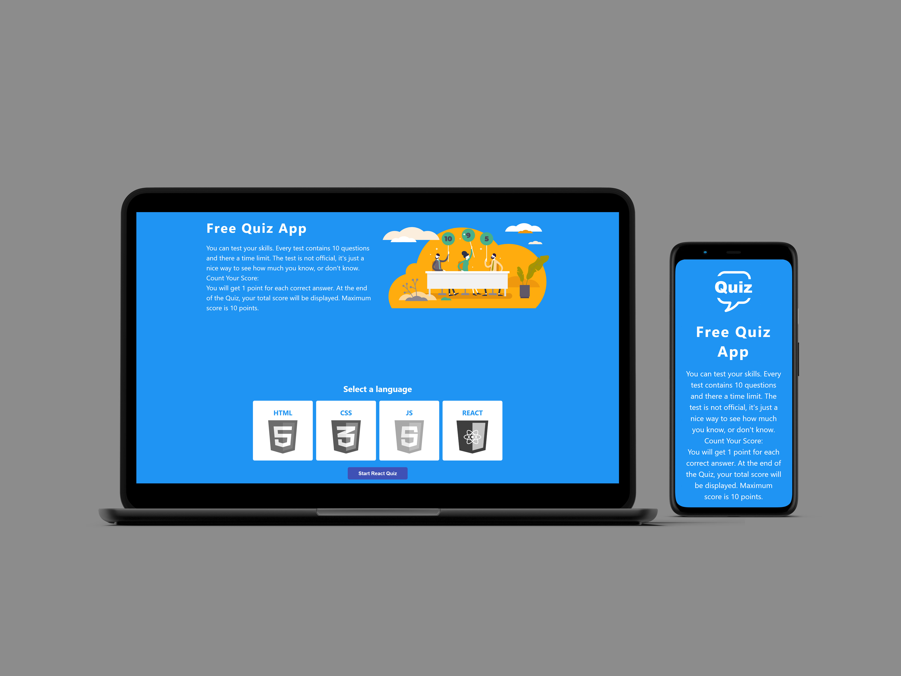

# **Frontend quiz App**

## Table of Contents

-   [Description](#Description)
-   [KeyFeatures](#key-features)
-   [TechnicalStack](#technical-stack)

**Live demo** [click here](https://frontend-quizzz-app.netlify.app/)

---

### **Description:**

The Frontend quiz App is an engaging quiz application developed using native js. The app challenges users with timed questions, providing an interactive and dynamic user experience. At the end of the quiz, users receive the score. The user can choose from multiple available exams in HTML, CSS, JS, React.

---

### **Key Features:**

1. **Timed Questions:**

    - Each question has a limited time for the user to answer.
    - If the timer runs out, the question is automatically skipped.

2. **Performance Summary:**

    - Provides a total score and percentage.

3. **User-Friendly Interface:**
    - Clean and intuitive design to enhance user engagement.
    - Clear indications of time remaining and question status.

---

### **Technical Stack:**

-   **HTML**
-   **CSS**
-   **native JavaScript**
